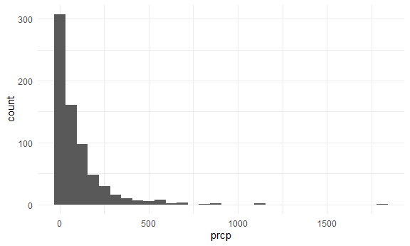
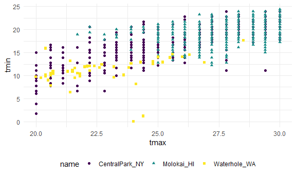
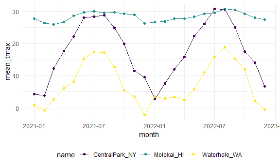
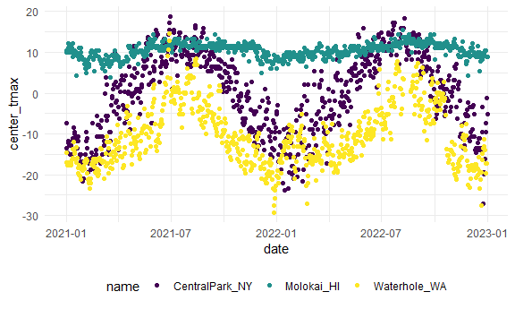

Numerical EDA
================
2026-10-08

load weather data

``` r
data("weather_df")

weather_df = 
  weather_df |> 
  mutate(
    month = lubridate::floor_date(date, unit = "month")
  )
```

now we have everything we need

``` r
weather_df |> 
  filter(prcp > 0) |> 
  ggplot(aes(x = prcp)) +
  geom_histogram()
```

    ## `stat_bin()` using `bins = 30`. Pick better value `binwidth`.



``` r
weather_df |> 
  filter(prcp > 0)
```

    ## # A tibble: 700 × 7
    ##    name           id          date        prcp  tmax  tmin month     
    ##    <chr>          <chr>       <date>     <dbl> <dbl> <dbl> <date>    
    ##  1 CentralPark_NY USW00094728 2021-01-01   157   4.4   0.6 2021-01-01
    ##  2 CentralPark_NY USW00094728 2021-01-02    13  10.6   2.2 2021-01-01
    ##  3 CentralPark_NY USW00094728 2021-01-03    56   3.3   1.1 2021-01-01
    ##  4 CentralPark_NY USW00094728 2021-01-04     5   6.1   1.7 2021-01-01
    ##  5 CentralPark_NY USW00094728 2021-01-15    97   7.8   3.3 2021-01-01
    ##  6 CentralPark_NY USW00094728 2021-01-16   198   8.3   2.8 2021-01-01
    ##  7 CentralPark_NY USW00094728 2021-01-20     5   4.4  -2.7 2021-01-01
    ##  8 CentralPark_NY USW00094728 2021-01-26    25   1.1  -0.5 2021-01-01
    ##  9 CentralPark_NY USW00094728 2021-01-31    30  -3.2  -6.6 2021-01-01
    ## 10 CentralPark_NY USW00094728 2021-02-01   470   1.1  -5.5 2021-02-01
    ## # ℹ 690 more rows

``` r
weather_df |> 
  filter(tmax >= 20, tmax <= 30) |> 
  ggplot(aes(x = tmax, y = tmin, color = name, shape = name)) +
  geom_point()
```



## `group_by`

``` r
weather_df |> 
  group_by(name, month)
```

    ## # A tibble: 2,190 × 7
    ## # Groups:   name, month [72]
    ##    name           id          date        prcp  tmax  tmin month     
    ##    <chr>          <chr>       <date>     <dbl> <dbl> <dbl> <date>    
    ##  1 CentralPark_NY USW00094728 2021-01-01   157   4.4   0.6 2021-01-01
    ##  2 CentralPark_NY USW00094728 2021-01-02    13  10.6   2.2 2021-01-01
    ##  3 CentralPark_NY USW00094728 2021-01-03    56   3.3   1.1 2021-01-01
    ##  4 CentralPark_NY USW00094728 2021-01-04     5   6.1   1.7 2021-01-01
    ##  5 CentralPark_NY USW00094728 2021-01-05     0   5.6   2.2 2021-01-01
    ##  6 CentralPark_NY USW00094728 2021-01-06     0   5     1.1 2021-01-01
    ##  7 CentralPark_NY USW00094728 2021-01-07     0   5    -1   2021-01-01
    ##  8 CentralPark_NY USW00094728 2021-01-08     0   2.8  -2.7 2021-01-01
    ##  9 CentralPark_NY USW00094728 2021-01-09     0   2.8  -4.3 2021-01-01
    ## 10 CentralPark_NY USW00094728 2021-01-10     0   5    -1.6 2021-01-01
    ## # ℹ 2,180 more rows

## `summerize()`

``` r
weather_df |> 
  group_by(name) |> 
  summarize(count = n())
```

    ## # A tibble: 3 × 2
    ##   name           count
    ##   <chr>          <int>
    ## 1 CentralPark_NY   730
    ## 2 Molokai_HI       730
    ## 3 Waterhole_WA     730

``` r
weather_df |> 
  group_by(name, month) |> 
  summarize(count = n())
```

    ## `summarise()` has regrouped the output.
    ## ℹ Summaries were computed grouped by name and month.
    ## ℹ Output is grouped by name.
    ## ℹ Use `summarise(.groups = "drop_last")` to silence this message.
    ## ℹ Use `summarise(.by = c(name, month))` for per-operation grouping
    ##   (`?dplyr::dplyr_by`) instead.

    ## # A tibble: 72 × 3
    ## # Groups:   name [3]
    ##    name           month      count
    ##    <chr>          <date>     <int>
    ##  1 CentralPark_NY 2021-01-01    31
    ##  2 CentralPark_NY 2021-02-01    28
    ##  3 CentralPark_NY 2021-03-01    31
    ##  4 CentralPark_NY 2021-04-01    30
    ##  5 CentralPark_NY 2021-05-01    31
    ##  6 CentralPark_NY 2021-06-01    30
    ##  7 CentralPark_NY 2021-07-01    31
    ##  8 CentralPark_NY 2021-08-01    31
    ##  9 CentralPark_NY 2021-09-01    30
    ## 10 CentralPark_NY 2021-10-01    31
    ## # ℹ 62 more rows

``` r
weather_df |> 
  group_by(month) |> 
  summarize(
    count = n(),
    n_days = n_distinct(date))
```

    ## # A tibble: 24 × 3
    ##    month      count n_days
    ##    <date>     <int>  <int>
    ##  1 2021-01-01    93     31
    ##  2 2021-02-01    84     28
    ##  3 2021-03-01    93     31
    ##  4 2021-04-01    90     30
    ##  5 2021-05-01    93     31
    ##  6 2021-06-01    90     30
    ##  7 2021-07-01    93     31
    ##  8 2021-08-01    93     31
    ##  9 2021-09-01    90     30
    ## 10 2021-10-01    93     31
    ## # ℹ 14 more rows

don’t do this

``` r
weather_df |> 
  pull(tmax) |> 
  summary()
```

    ##    Min. 1st Qu.  Median    Mean 3rd Qu.    Max.     NAs 
    ##  -11.40    7.20   20.60   17.86   28.30   36.70      17

do this instead

``` r
weather_df |> 
  group_by(name) |> 
  summarize(
    mean_tmax = mean(tmax, na.rm = TRUE),
    median_tmax = median(tmax, na.rm = TRUE),
    sd_prcp = sd(prcp, na.rm = TRUE),
    q95_prcp = quantile(prcp, 0.95, na.rm = TRUE)
  ) |> 
  knitr::kable(digits = 2)
```

| name           | mean_tmax | median_tmax | sd_prcp | q95_prcp |
|:---------------|----------:|------------:|--------:|---------:|
| CentralPark_NY |     17.66 |        18.9 |  113.40 |      198 |
| Molokai_HI     |     28.32 |        28.3 |   63.24 |       41 |
| Waterhole_WA   |      7.38 |         6.1 |  110.81 |      279 |

knitr::kable gives table

``` r
weather_df |> 
  group_by(name, month) |> 
  summarize(
    mean_tmax = mean(tmax, na.rm = TRUE)
  ) |> 
  pivot_wider(
    names_from = name,
    values_from = mean_tmax
  ) |> 
  knitr::kable(digits = 2)
```

    ## `summarise()` has regrouped the output.
    ## ℹ Summaries were computed grouped by name and month.
    ## ℹ Output is grouped by name.
    ## ℹ Use `summarise(.groups = "drop_last")` to silence this message.
    ## ℹ Use `summarise(.by = c(name, month))` for per-operation grouping
    ##   (`?dplyr::dplyr_by`) instead.

| month      | CentralPark_NY | Molokai_HI | Waterhole_WA |
|:-----------|---------------:|-----------:|-------------:|
| 2021-01-01 |           4.27 |      27.62 |         0.80 |
| 2021-02-01 |           3.87 |      26.37 |        -0.79 |
| 2021-03-01 |          12.29 |      25.86 |         2.62 |
| 2021-04-01 |          17.61 |      26.57 |         6.10 |
| 2021-05-01 |          22.08 |      28.58 |         8.20 |
| 2021-06-01 |          28.06 |      29.59 |        15.25 |
| 2021-07-01 |          28.35 |      29.99 |        17.34 |
| 2021-08-01 |          28.81 |      29.52 |        17.15 |
| 2021-09-01 |          24.79 |      29.67 |        12.65 |
| 2021-10-01 |          19.93 |      29.13 |         5.48 |
| 2021-11-01 |          11.54 |      28.85 |         3.53 |
| 2021-12-01 |           9.59 |      26.19 |        -2.10 |
| 2022-01-01 |           2.85 |      26.61 |         3.61 |
| 2022-02-01 |           7.65 |      26.83 |         2.99 |
| 2022-03-01 |          11.99 |      27.73 |         3.42 |
| 2022-04-01 |          15.81 |      27.72 |         2.46 |
| 2022-05-01 |          22.25 |      28.28 |         5.81 |
| 2022-06-01 |          26.09 |      29.16 |        11.13 |
| 2022-07-01 |          30.72 |      29.53 |        15.86 |
| 2022-08-01 |          30.50 |      30.70 |        18.83 |
| 2022-09-01 |          24.92 |      30.41 |        15.21 |
| 2022-10-01 |          17.43 |      29.22 |        11.88 |
| 2022-11-01 |          14.02 |      27.96 |         2.14 |
| 2022-12-01 |           6.76 |      27.35 |        -0.46 |

``` r
weather_df |> 
  group_by(name, month) |> 
  summarize(
    mean_tmax = mean(tmax, na.rm = TRUE)
  ) |> 
  ggplot(aes(x = month, y = mean_tmax, color = name)) +
  geom_point() + 
  geom_line()
```

    ## `summarise()` has regrouped the output.
    ## ℹ Summaries were computed grouped by name and month.
    ## ℹ Output is grouped by name.
    ## ℹ Use `summarise(.groups = "drop_last")` to silence this message.
    ## ℹ Use `summarise(.by = c(name, month))` for per-operation grouping
    ##   (`?dplyr::dplyr_by`) instead.



``` r
weather_df |> 
  mutate(center_tmax = tmax - mean(tmax, na.rm = TRUE)) |> 
  ggplot(aes(x = date, y = center_tmax, color = name)) +
  geom_point()
```

    ## Warning: Removed 17 rows containing missing values or values outside the scale range
    ## (`geom_point()`).



## what about “window” functions

try to rank things

``` r
weather_df |> 
  group_by(name, month) |> 
  mutate(temp_rank = min_rank(desc(tmax))) |> 
  filter(temp_rank < 2)
```

    ## # A tibble: 104 × 8
    ## # Groups:   name, month [72]
    ##    name           id          date        prcp  tmax  tmin month      temp_rank
    ##    <chr>          <chr>       <date>     <dbl> <dbl> <dbl> <date>         <int>
    ##  1 CentralPark_NY USW00094728 2021-01-02    13  10.6   2.2 2021-01-01         1
    ##  2 CentralPark_NY USW00094728 2021-02-24     0  12.2   3.9 2021-02-01         1
    ##  3 CentralPark_NY USW00094728 2021-03-26    48  27.8  11.1 2021-03-01         1
    ##  4 CentralPark_NY USW00094728 2021-04-28    13  29.4  11.1 2021-04-01         1
    ##  5 CentralPark_NY USW00094728 2021-05-22     0  31.7  18.3 2021-05-01         1
    ##  6 CentralPark_NY USW00094728 2021-06-30   165  36.7  22.8 2021-06-01         1
    ##  7 CentralPark_NY USW00094728 2021-07-06   140  33.3  21.7 2021-07-01         1
    ##  8 CentralPark_NY USW00094728 2021-08-13     0  34.4  25.6 2021-08-01         1
    ##  9 CentralPark_NY USW00094728 2021-09-15     0  29.4  21.7 2021-09-01         1
    ## 10 CentralPark_NY USW00094728 2021-10-15     0  26.1  17.2 2021-10-01         1
    ## # ℹ 94 more rows

min_rank ranks from smallest value

## lead and lag

``` r
weather_df |> 
  group_by(name) |> 
  mutate(
    lagged_tmax = lag(tmax, 3),
    lead_tmax = lead(tmax)
  ) 
```

    ## # A tibble: 2,190 × 9
    ## # Groups:   name [3]
    ##    name      id    date        prcp  tmax  tmin month      lagged_tmax lead_tmax
    ##    <chr>     <chr> <date>     <dbl> <dbl> <dbl> <date>           <dbl>     <dbl>
    ##  1 CentralP… USW0… 2021-01-01   157   4.4   0.6 2021-01-01        NA        10.6
    ##  2 CentralP… USW0… 2021-01-02    13  10.6   2.2 2021-01-01        NA         3.3
    ##  3 CentralP… USW0… 2021-01-03    56   3.3   1.1 2021-01-01        NA         6.1
    ##  4 CentralP… USW0… 2021-01-04     5   6.1   1.7 2021-01-01         4.4       5.6
    ##  5 CentralP… USW0… 2021-01-05     0   5.6   2.2 2021-01-01        10.6       5  
    ##  6 CentralP… USW0… 2021-01-06     0   5     1.1 2021-01-01         3.3       5  
    ##  7 CentralP… USW0… 2021-01-07     0   5    -1   2021-01-01         6.1       2.8
    ##  8 CentralP… USW0… 2021-01-08     0   2.8  -2.7 2021-01-01         5.6       2.8
    ##  9 CentralP… USW0… 2021-01-09     0   2.8  -4.3 2021-01-01         5         5  
    ## 10 CentralP… USW0… 2021-01-10     0   5    -1.6 2021-01-01         5         2.8
    ## # ℹ 2,180 more rows

- lag takes value previous row and pastes it to next column
- the first lag column is always NA
- lead does the opposite

``` r
weather_df |> 
  group_by(name) |> 
  mutate(
    temp_change = tmax - lag(tmax)
  ) |> 
  summarize(
    mean_temp_change = mean(temp_change, na.rm = TRUE),
    sd_temp_change = sd(temp_change, na.rm = TRUE)
  )
```

    ## # A tibble: 3 × 3
    ##   name           mean_temp_change sd_temp_change
    ##   <chr>                     <dbl>          <dbl>
    ## 1 CentralPark_NY         0.0115             4.43
    ## 2 Molokai_HI            -0.000688           1.24
    ## 3 Waterhole_WA          -0.00155            3.04

## revisit some examples

``` r
pulse_df =
  haven::read_sas("public_pulse_data.sas7bdat") |> 
  janitor::clean_names() |> 
  pivot_longer(
    bdi_score_bl:bdi_score_12m,
    names_to = "visit",
    names_prefix = "bdi_score_",
    values_to = "bdi"
  ) |> 
  mutate(
    visit = replace(visit, visit == "bl", "00m")
  )
```

- before tidying, check to see if you need to pivot (run up to
  janitor::clean_names)
- names_to = what you want to make the variable
- names_prefix = the similarities of the variable by a prefix, what you
  want to change to names_to
- values_to = name of variable value
- replace is for matching prefix/suffix with other variables

``` r
pulse_df |> 
  group_by(visit) |> 
  summarize(
    BDI_mean = mean(bdi,na.rm = TRUE),
    BDI_median = median(bdi, na.rm = TRUE)
  ) |> 
  knitr::kable(digits = 2)
```

| visit | BDI_mean | BDI_median |
|:------|---------:|-----------:|
| 00m   |     7.99 |          6 |
| 01m   |     6.05 |          4 |
| 06m   |     5.67 |          4 |
| 12m   |     6.10 |          4 |

``` r
pups_df =
  read_csv("FAS_pups.csv", skip = 3, na = c("", ".", "NA")) |> 
  janitor::clean_names() |> 
  mutate(sex = recode(sex, `1` = "male", `2` = "female")) 
```

    ## Rows: 313 Columns: 6
    ## ── Column specification ────────────────────────────────────────────────────────
    ## Delimiter: ","
    ## chr (1): Litter Number
    ## dbl (5): Sex, PD ears, PD eyes, PD pivot, PD walk
    ## 
    ## ℹ Use `spec()` to retrieve the full column specification for this data.
    ## ℹ Specify the column types or set `show_col_types = FALSE` to quiet this message.

``` r
litters_df =
  read_csv("FAS_litters.csv", na = c("", ".", "NA")) |> 
  janitor::clean_names() |> 
  separate(group, into = c("dose", "day_of_tx"), 3)
```

    ## Rows: 49 Columns: 8
    ## ── Column specification ────────────────────────────────────────────────────────
    ## Delimiter: ","
    ## chr (2): Group, Litter Number
    ## dbl (6): GD0 weight, GD18 weight, GD of Birth, Pups born alive, Pups dead @ ...
    ## 
    ## ℹ Use `spec()` to retrieve the full column specification for this data.
    ## ℹ Specify the column types or set `show_col_types = FALSE` to quiet this message.

``` r
fas_df =
  left_join(pups_df, litters_df, by = "litter_number")

fas_df |> 
  group_by(dose, day_of_tx) |> 
  drop_na(dose) |> 
  summarize(
    mean_pivot = mean(pd_pivot, na.rm = TRUE)) |> 
  pivot_wider(
    names_from = dose, 
    values_from = mean_pivot) |> 
  knitr::kable(digits = 2)
```

    ## `summarise()` has regrouped the output.
    ## ℹ Summaries were computed grouped by dose and day_of_tx.
    ## ℹ Output is grouped by dose.
    ## ℹ Use `summarise(.groups = "drop_last")` to silence this message.
    ## ℹ Use `summarise(.by = c(dose, day_of_tx))` for per-operation grouping
    ##   (`?dplyr::dplyr_by`) instead.

| day_of_tx |  Con |  Low |  Mod |
|:----------|-----:|-----:|-----:|
| 7         | 7.00 | 7.94 | 6.98 |
| 8         | 6.24 | 7.72 | 7.04 |
